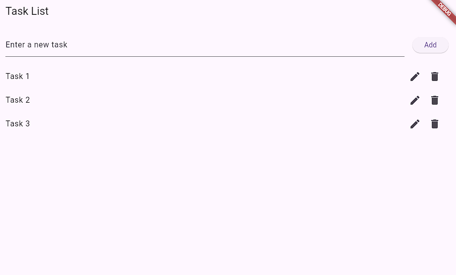
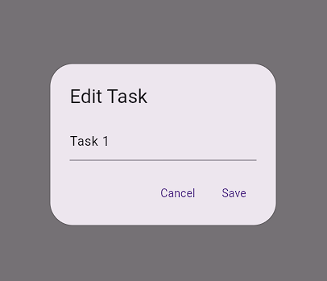

# my_app 
Приложение для создания и редактирования списка задач

Приложение написано на языке Dart с использованием фреймворка Flutter.
Код написан при помощи нейросети anthropic/claude-3-haiku через расширение для VSCode CLINE

## Начало работы

### Установка и настройка

1. **Установка необходимого ПО**
   - Установите [Git](https://git-scm.com/downloads)
   - Установите [Python 3.9+](https://www.python.org/downloads/)
   - Установите [Visual Studio Code](https://code.visualstudio.com/download)
     - Откройте VSCode и перейдите в раздел Extensions (Ctrl+Shift+X).
     - Установите следующие расширения:
         - Flutter (официальное расширение для поддержки Flutter).
         - Dart (для поддержки языка Dart).
         - CLINE(Автономный агент кодирования для VSCode)
   - Установите [Установите Android Studio](https://developer.android.com/studio)


2. **Установка Flutter SDK**
    
    1. **Загрузите Flutter SDK**:
       - Перейдите на официальный сайт [Flutter](https://flutter.dev).
       - Скачайте последнюю стабильную версию Flutter SDK для вашей операционной системы (Windows, macOS, Linux).
    
    2. **Распакуйте архив**:
       - Поместите распакованную папку `flutter` в удобное для вас место на диске (например, `C:\flutter` на Windows).
    
    3. **Добавьте Flutter в системные переменные**:
       - **Windows**:
         - Откройте **Панель управления > Система и безопасность > Система > Дополнительные параметры системы > Переменные среды**.
         - В разделе **Системные переменные** найдите `Path` и нажмите **Изменить**.
         - Добавьте путь к папке `flutter\bin` (например, `C:\flutter\bin`).
       - **macOS/Linux**:
         - Откройте терминал и добавьте строку в ваш `.bashrc`, `.zshrc` или `.bash_profile`:
           ```bash
           export PATH="$PATH:[путь_до_flutter]/flutter/bin"
           ```
         - Пример для macOS: `export PATH="$PATH:/Users/username/flutter/bin"`.
         - После этого выполните команду `source ~/.bashrc` (или другой файл, который вы редактировали).
    
    4. **Проверка установки**:
       - Откройте терминал (или командную строку) и выполните команду:
         ```bash
         flutter doctor
         ```
       - Эта команда проверит, правильно ли установлен Flutter, и укажет на недостающие компоненты (например, Android Studio, Xcode).
    
3. **Установка и настройка CLINE**
    1. **Установка расширения CLINE**:
   - Откройте VSCode и перейдите в раздел **Extensions** (`Ctrl+Shift+X`).
   - Найдите **CLINE** и установите расширение.
Если вы все сделали правильно, то на панели инструментов слева в VSCode появится значок с роботом (см. рис. 1), это и есть наш CLINE.   


**Рис. 1. Значок CLINE на панеле инструментов в VSCode**

   2. **Настройка CLINE**:
     - Кликните по значку робота.
     - В меню иструметов **CLINE** (рис. 2) нажмите на значок "шестеренки" (настройки).
     - Выбираем в поле **API Provider** OpenRouter (рис. 3) или OpenAI Compatible для VSEGPT.ru (рис. 4).
     - Вставьте ваш **OpenRouter API Key** или **API Key**.
     - Выбираем модель **Model** или **Model ID**.
     - Нажимаем **Done**, чтобы применить настройки.


   3. **Проверка работы CLINE**:
    - В нижней части CLINE (рис. 5) введите свой вопрос и нажмите "стрелочку" для отправки задания. В качестве дополнения можно прикрепить скриншот,  например, ошибки, если она не в консоле, а в интерфейсе приложения.
    - Установив галочку **Auto-approve**, вы разрешаете CLINE выполнять задачи без подтверждения.


     
**ВАЖНО:** Пользуйтесь системами контроля версий, например, Git. Обязательно делайте коммиты (Commit) после каждой задачи CLINE. LLM для экономии токенов пользуются механизмом поиска и замены фрагментов, помечая специальными тегами для себя фрагменты, где код не изменился, чтобы его лишний раз не передавать в LLM. И бывают ситуации, когда эти теги CLINE забывает заменить на реальный код. Это видно сразу - измененные файлы уменьшились в разы, а во вкладке **PROBLEMS** (`Ctrl+SHIFT+M`) окна вывода красуется длинный список ошибок. Вот тогда необходимо откатить версию и повторить задачу. Чаще всего это происходит, когда прилетает код ошибки от провайдера LLM: неизвестная команда или API недоступно. В случае ошибки от CLINE нажимаем на кнопку **Resume Task** или **Proceed Anyway**, также можно в окно ввода задачи внести пояснения для LLM, и задача продолжится с учетом дополнительных данных.
     
4. **Клонирование проекта**
   ```bash
   # Клонируйте репозиторий
   git clone https://github.com/d-synchikov/my_app
   # Перейдите в директорию проекта
   cd my_app
   ```
5. **Запуск отладки**

  Для запуска отладки необходимо в терминале:
  ```bash
  [путь к папке проекта]/my_app> flutter run
  ```
  Приложение запустится для отладки в выбранном эмуляторе.

6. **Внешний вид приложения**


**Рис. 2 Внешний вид приложения**

7. **Описание функционала**
     - Для добавления задачи используется текстовое поле и кнопка "Add"
     - Для редактирования или удаления есть соответствующие значки напротив каждого введенного задания

        
        
        **Рис.3 Кнопки управления задачами**
     - Редактирование производится в отдельном окне
        

        **Рис. 4 Редактирование задачи**
     
